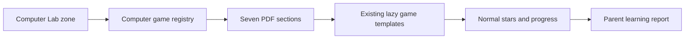

# Computer Lab curriculum world

Computer Lab turns seven parent-provided Class II
Computer Studies PDFs into short interactive games while keeping the 15 EVS worlds unchanged.

## Runtime architecture



- World metadata: `packages/config/src/zones.ts`
- Catalog assembler: `packages/game-engine/src/games/evs/computers.ts`
- Typed factories and section content: `packages/game-engine/src/games/evs/computers/`
- Registry: `packages/game-engine/src/games/evs/index.ts`
- Section UI and progress: `apps/web/app/(play)/play/SectionedGameList.tsx`
- Theme: `packages/game-engine/src/core/themes.ts`
- Coverage contract: `packages/game-engine/src/games/evs/computers.test.ts`

The source PDFs are not bundled into the website. The games use faithful child-friendly
paraphrases, device symbols and interactive diagrams.

## Source coverage

| Section | Source PDF | Source items | Games |
|---|---|---:|---:|
| First Term Power-Up | Term I Revision Worksheet | 23 | 6 |
| Computer & AI Mega Notes | Lesson 1 + Lesson 3 Notes | 42 | 9 |
| Device Detective | Computer Revision Worksheet | 10 | 2 |
| Computer Jobs 1 | Lesson 1 Worksheet 1 | 6 | 2 |
| AI Smart Notes | Lesson 3 Learn with AI Notes | 6 | 2 |
| Computer Jobs 2 | Lesson 1 Worksheet 2 | 6 | 2 |
| AI Challenge | Lesson 3 Learning with AI Worksheet 1 | 5 | 2 |

Total: **98 source items across 25 games**.

The ordered `CurriculumSection[]` catalog is the single runtime source for section metadata,
games, source-item coverage and practice/challenge roles. `computersGames` is flattened from that
catalog for the existing registry. `GameConfig` remains source-agnostic. The coverage test fails
if a section is missing an item, has anything other than one final challenge, contains duplicate
game IDs, creates malformed answer structures, or creates an empty sorting category.

## Learning design

Each source section is shown as a folder instead of one long question bank:

1. The kid UI says “7 folders” and never shows source PDF names or source-item counts.
2. The first activity teaches or recalls a small concept group.
3. Different interactions alternate choosing, sorting, sequencing and true/false decisions.
4. The final activity is visibly labeled **Final challenge**.
5. The final challenge unlocks after every practice game in its folder has earned a star.
6. Completing every game changes the folder state to **Mastered**.
7. The complete first folder is free; later folders stay together behind the grown-up unlock flow
   and do not expand into rows of child-facing paywall prompts.

The design uses existing game templates so sound, immediate correction, streaks, replay,
confetti and star rewards stay consistent with the rest of FunBerry. PixiJS is loaded only for
the word-unscramble game.

## Content rules

- Correct spelling and grammar from worksheets without changing the expected answer.
- Use “In this lesson” or “The worksheet says” when a simplified school claim is not universally true.
- Do not teach that every robot uses AI. The worksheet's expected answer is preserved with a
  child-friendly note that some robots use AI and some do not.
- Do not show school names, student details, teacher marks or original PDF pages in the child UI.
- New or edited source questions must update `sourceItemIds` and pass the coverage test.

## Verification

```bash
npm run test:lesson-gen
npm run typecheck
npm run build --workspace=@funberry/web
```

Then exercise the real flow at `/play`: select a child, open Computer Lab, open all seven
missions, complete at least one quiz and one sorting game, and confirm stars persist.
