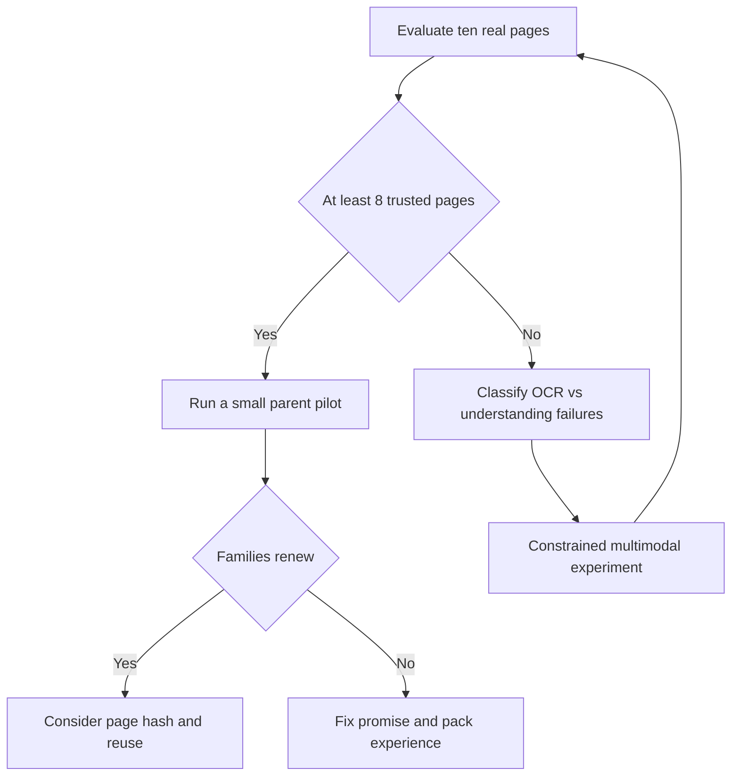

# Learning Packs: architecture and evidence gate

Learning Packs turn pages chosen by a parent into short games for that parent's children.
They reinforce a page; they do not complete homework, grade a child, or claim ownership of
publisher content.

## Current architecture

```mermaid
flowchart LR
  Upload[Parent uploads 1–5 pages] --> OCR[Tesseract OCR in browser]
  OCR --> Edit[Parent corrects extracted text]
  Edit --> Rules[Deterministic rules engine]
  Rules --> Review[Parent reviews and removes weak games]
  Review --> Pack[Private Supabase pack]
  Pack --> Assign[Parent assigns children]
  Assign --> Play[Child opens My Lessons]
  Play --> Progress[Progress saved with RLS]
```



| Stage | Runtime | Source of truth |
|---|---|---|
| Upload and OCR | Parent's browser | `apps/web/app/(dashboard)/dashboard/packs/` |
| OCR quality | Shared pure thresholds | `packages/game-engine/src/lesson/ocrQuality.ts` |
| Text cleaning and generation | Parent's browser | `packages/game-engine/src/lesson/rulesEngine.ts` |
| Parent review | Parent dashboard | `PackReviewEditor.tsx` |
| Pack, pages and assignments | Supabase Postgres | migration `017_learning_packs.sql` |
| Original photos | Private Supabase Storage | bucket `book-uploads` |
| Child play | `/play` client SPA | existing lazy-loaded game templates |
| Scores and stars | Supabase Postgres | `progress` and ownership-checked RPCs |

There is no LLM in this flow. Tesseract extracts text locally. The rules engine can create
fill-in-the-blank, true/false, sort, word-match, memory and sequence games from reviewed text.

## Trust boundaries

- The parent is the authenticated account holder. The child plays inside that parent's session.
- `learning_packs`, `pack_pages`, and `pack_assignments` are scoped to `auth.uid()` by RLS.
- Storage paths begin with the parent's user ID. A family cannot read another family's source photos.
- A generated game is not available to the child until the parent reviews and saves the pack.
- Uploaded images and OCR evaluation outputs must never be committed to Git.
- Do not place service-role keys, parent PINs, child photos, OCR text, or textbook photos in logs.

The current parent review is the safety gate. Structural validation removes malformed game
objects, but it cannot prove that a sentence or answer is educationally correct.

## Ten-page evidence gate

Do not expand this pipeline based on demos alone. Test the generator against ten varied real pages:

- text-heavy pages;
- diagrams or labels;
- lists or ordered steps;
- a clear photograph;
- a dim, skewed or otherwise difficult photograph.

Source photos remain outside Git. Run:

```bash
npm run eval:packs -- --input "/absolute/path/to/textbook-pages"
```

The evaluator selects the first ten sorted images by default. Pin an explicit set when comparing runs:

```bash
npm run eval:packs -- \
  --input "/absolute/path/to/textbook-pages" \
  --files "page-01.jpg,page-02.jpg,page-03.jpg,page-04.jpg,page-05.jpg,page-06.jpg,page-07.jpg,page-08.jpg,page-09.jpg,page-10.jpg" \
  --seed 20260826
```

It writes a private bundle under `.local/learning-pack-evals/<timestamp>/`:

- `evaluation.json`: OCR text, cleaned text, generated games, warnings and diagnostics;
- `human-review.json`: the manual trust rubric to complete;
- `REPORT.md`: page summary and gate result.

For each page, compare the source image with every generated question and answer. Complete:

- `groundedInPage`: every fact and answer is present on the page;
- `answersCorrect`: every marked answer is correct;
- `ageSuitability`: 1–5 for ages 5–8;
- `usefulness`: 1–5 as reinforcement for the page;
- `fixBurden`: `none`, `minor`, or `major`;
- `notes`: concrete failure examples.

After editing `human-review.json`, calculate the result without repeating OCR:

```bash
npm run eval:packs -- --score ".local/learning-pack-evals/<timestamp>"
```

### Pass rule

A page is trusted only when:

1. it contains no unsupported facts;
2. all answers are correct;
3. age suitability is at least 4/5;
4. usefulness is at least 4/5;
5. manual fixes are none or minor.

The evidence gate passes at **8 trusted pages out of 10**. Automated counts are diagnostics, not
the verdict. A high OCR confidence score does not mean the generated lesson is correct.

## Decision after the gate



If the gate fails, first separate OCR failures from concept-understanding failures. Only then test a
server-side multimodal generator. Any model output must map to existing `GameConfig` types, cite
source evidence, pass structural checks, and still require parent approval.

If the gate passes, test real parent use and first-cycle renewal before building a shared page
library. Hash-based reuse is valuable only for lessons families already trust.

## Known gaps

- Coaching reports currently build their lookup from pre-authored EVS games, so pack progress is
  saved but is not fully attributed in parent skill reports.
- Pack game generation uses parent-reviewed combined text rather than page-level concept links.
- Saved packs cannot yet be reopened for full regeneration in the UI.
- OCR confidence, generation warnings and parent edit burden are not persisted to production tables.
- No shared page hash/library exists.

These gaps are recorded, not authorization to implement all of them immediately.

## Deliberately deferred

Until the evidence gate is measured:

- no multimodal LLM production pipeline;
- no cross-family page library or deduplication schema;
- no teacher/classroom workflow;
- no mastery model, difficulty ladder or spaced repetition;
- no weekly email or broad analytics platform;
- no child identity-verification design without legal advice.

The next product decision comes from page trust and family renewal, not from adding more features.
